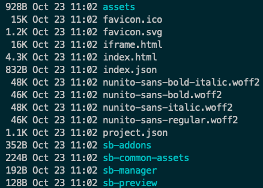
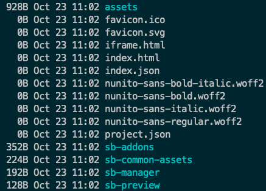

# NX Storybook Build Issue

## Successful Build

```
yarn nx run nx-cli:build-storybook

ls -l apps/nx-cli/storybook-static
```



## Failed Build

```
yarn nx run nx-cli:build-storybook --output-dir=/tmp/storybook

ls -l /tmp/storybook
```


